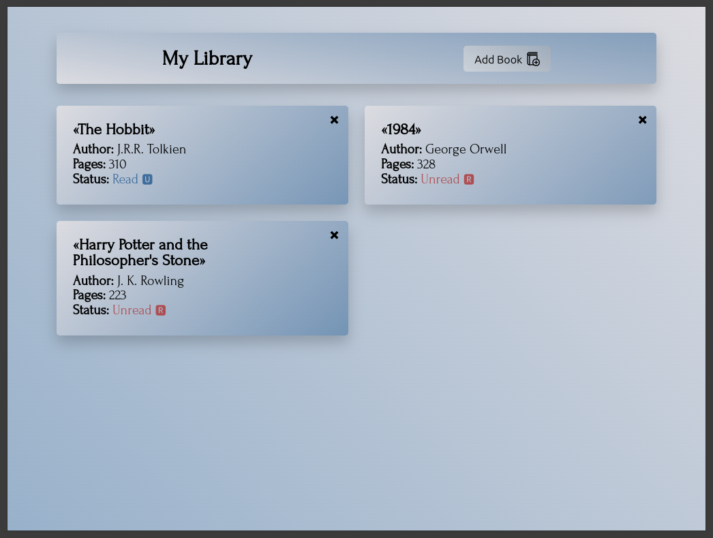

# Library App - The Odin Project



A web-based library management application that lets users track their book collection. Users can add new books, mark them as read/unread, and remove entries as needed.

## Features

- 📖 Add new books with title, author, page count, and read status
- ✅ Toggle between read/unread status with visual indicators
- 🗑️ Delete books from the library
- 📱 Responsive design that works on different screen sizes
- 🎨 Clean and modern UI with subtle gradients and animations
- 📦 Persistent data storage using browser memory (page session)
- 📝 Form validation for required fields

## Usage

1. Click the "Add Book" button to open the form dialog
2. Fill in the book details:
   - Title (required)
   - Author (required)
   - Page count (required)
   - Read status checkbox
3. Click "Add" to submit the form
4. Manage existing books:
   - Click "🆁" to mark as read
   - Click "🆄" to mark as unread
   - Click "✖" to remove a book

## Technical Details

### Technologies Used

- HTML5 (including dialog element)
- CSS3 (Grid, Flexbox, custom fonts, gradients)
- Vanilla JavaScript (ES6)

### Key Features

- **Object-Oriented Design**: Uses constructor functions and prototypes
- **Dynamic DOM Manipulation**: Creates/updates book cards in real-time
- **Form Validation**: Built-in HTML5 validation with custom styling
- **Modal Dialog**: Native `<dialog>` element implementation
- **Responsive Grid Layout**: Auto-adjusting cards based on screen size

### File Structure

```
library-app/
├── index.html
├── assets/
│   ├── css/
│   │   └── styles.css
│   ├── scripts/
│   │   └── main.js
│   ├── icons/
│   │   ├── book-add.svg
│   │   └── favicon.svg
│   ├── fonts/
│   │   └── Forum-Regular.woff2
│   └── screenshots/
│       └── screenshot.png
```

## Future Improvements

- [ ] Add local storage persistence
- [ ] Implement edit book functionality
- [ ] Add search/filter capabilities
- [ ] Include sorting options (by title, author, pages)
- [ ] Add book rating system
- [ ] Implement user authentication
- [ ] Add dark mode toggle

## Acknowledgments

- [The Odin Project](https://www.theodinproject.com/) for the project concept and curriculum
- [SVG Repo](https://www.svgrepo.com/) for icon resources
- [Forum typeface](https://fonts.google.com/specimen/Forum) designed by Denis Masharov
